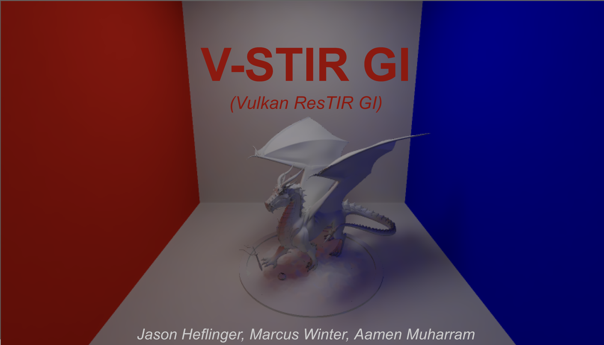
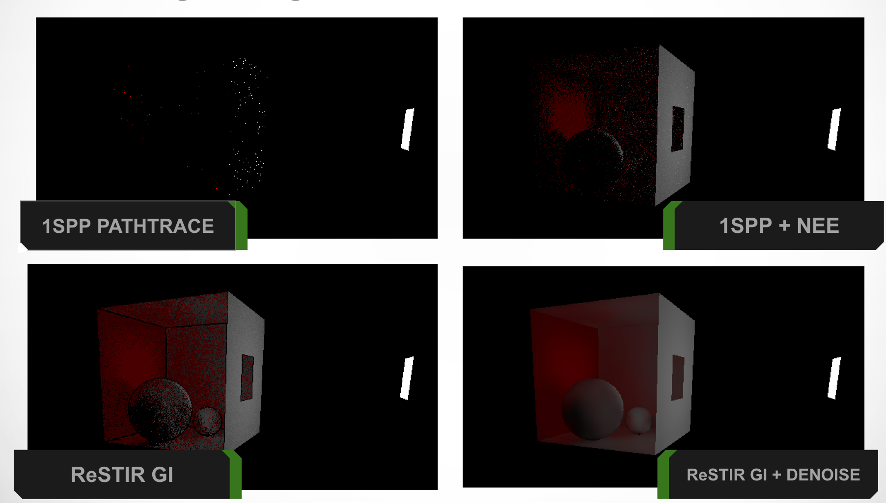

# V-STIR GI
Vulkan based real time path tracer implementing ReSTIR GI, with realtime bilateral filter and offline denoising.
#### Jason Heflinger, Marcus Winter, Aamen Muharram

### Paper implemented: [ReSTIR GI](https://research.nvidia.com/publication/2021-06_restir-gi-path-resampling-real-time-path-tracing)
- Authors 
  - Yaobin Ouyang (NVIDIA)
  - Shiqiu Liu (NVIDIA)
  - Markus Kettunen
  - Matt Pharr
  - Jacopo Pantaleoni (NVIDIA)

### Results

### Presentation
[Slides here](https://docs.google.com/presentation/d/11Y8Kyf7GDPpixAVTBfMYWxZjZjLVIBZGS37FBkY9EA4/edit?usp=sharing)