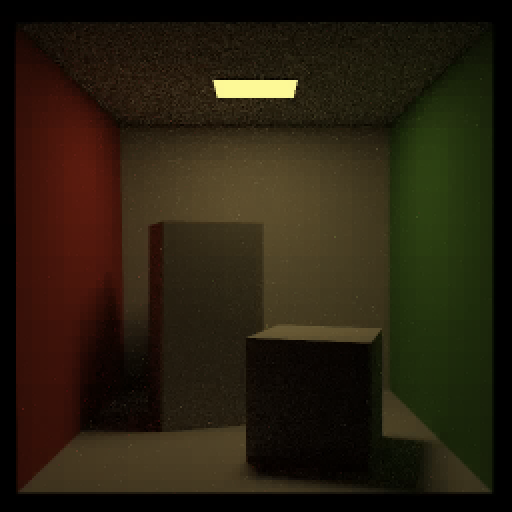
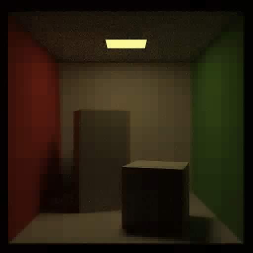
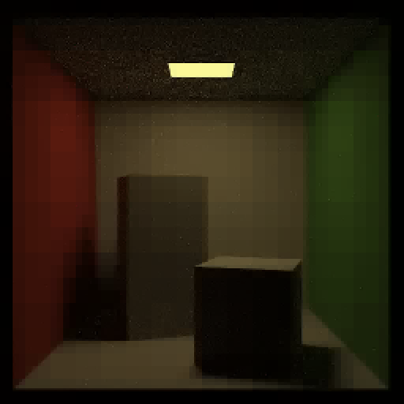
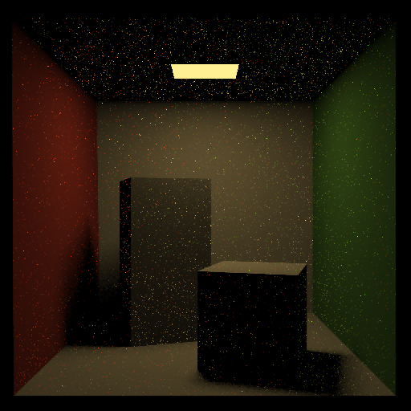
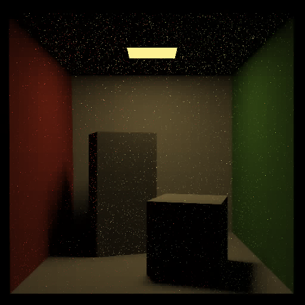
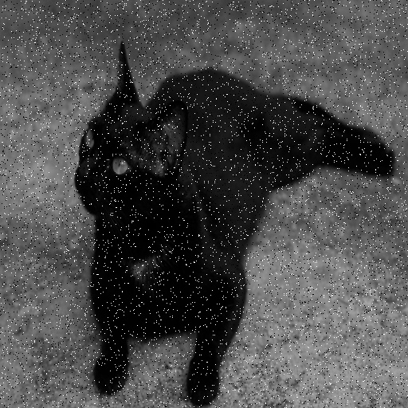

# Haar Denoiser
the denoiser binary runs the denoiser on all images in the `data/` folder and outputs it to the `denoised_data/` folder.
To run do:
```sh
denoiser bias
```
where bias is any float number. Below is some sample images with different bias values

| original | 0.0 | 0.02 | 0.07|
| --- | --- | --- | --- |
|  |  |  | |
|  |  |  | |
|  |  |  | |
|  |  |  | |
